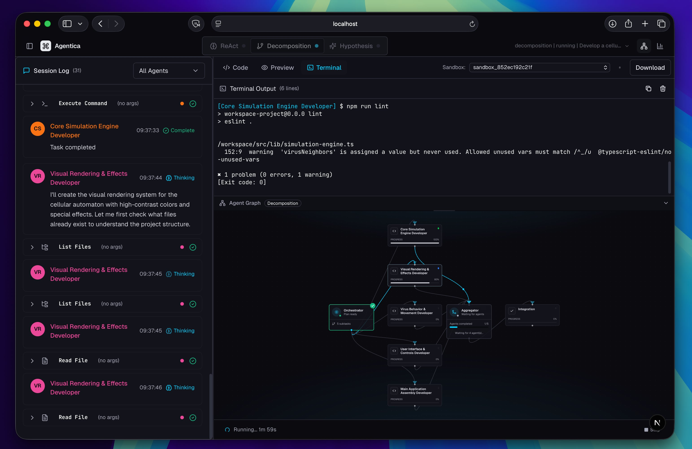

# Agentica

> **Alpha -- Research Repository**
> This is an active research project, not a product. APIs, architecture, and behavior may change without notice. Things can (and probably will) break.

A multi-agent system for AI-assisted coding that compares three orchestration paradigms: **Single ReAct Agent**, **Task Decomposition Swarm**, and **Parallel Hypothesis Testing**. A visual "mission control" dashboard lets you observe agents reasoning, writing code, and collaborating in real time.



Instead of treating AI code generation as a black box, Agentica lets you watch what's actually happening. The dashboard visualizes agent graphs, streams thinking and tool calls live, and lets you compare how different orchestration strategies tackle the same coding task -- from a single ReAct loop to a full parallel hypothesis race.

## Features

### Three Agent Modes

- **ReAct (Single Agent)** -- A simple reason-act-review loop. One agent operates in one sandbox, cycling through reasoning, tool execution, and self-review. Great for straightforward tasks and as a baseline for comparison.

- **Task Decomposition** -- An orchestrator analyzes the task and decomposes it into subtasks. Parallel sub-agents execute each subtask in isolated sandboxes. An aggregator merges the results and an integration review validates the final output. Best for complex, multi-part problems.

- **Parallel Hypothesis** -- Multiple agents (default: 3) independently solve the full task using different approaches. An evaluator scores each solution and selects the winner. Ideal for exploring the solution space and finding the best approach.

### Mission Control Dashboard

- Real-time agent graph visualization with React Flow
- Live streaming of agent thinking, tool calls, and outputs
- Integrated code editor (Monaco) with file tree navigation
- Terminal output and web preview panes
- Side-by-side mode comparison

## Quick Start

### Prerequisites

- [Docker](https://www.docker.com/) (for sandboxed code execution)
- [Node.js](https://nodejs.org/) 20+
- [Python](https://www.python.org/) 3.12+
- [UV](https://github.com/astral-sh/uv) (Python package manager)

### Setup

```bash
# Clone the repository
git clone https://github.com/Liad0205/agentica
cd agentica

# Sync backend dependencies (project lives in backend/)
cd backend
UV_CACHE_DIR=../.uv-cache uv sync --extra dev
cd ..

# Install frontend dependencies
cd frontend && npm install && cd ..
```

Note: Python tooling for this repo is scoped to `backend/pyproject.toml`, so the
expected virtualenv is `backend/.venv` (not a root-level `.venv`).

### Environment Variables

Copy the example environment file and fill in your API keys:

```bash
cp env.example .env
```

Required variables:

| Variable         | Description                                              |
| ---------------- | -------------------------------------------------------- |
| `XAI_API_KEY`    | API key for Grok models                                  |
| `GEMINI_API_KEY` | API key for Gemini models                                |
| `DEFAULT_MODEL`  | Default LLM model (e.g. `gemini/gemini-3-flash-preview`) |
| `USE_MOCK_LLM`   | Set to `true` for testing without API costs              |

See `env.example` for the full list of configuration options including agent limits, sandbox settings, and server configuration.

### Build and Run

```bash
# Build the sandbox Docker image (required before first run)
make sandbox-image

# Start the full stack
make dev
```

Or start services manually:

```bash
# Backend
cd backend && UV_CACHE_DIR=../.uv-cache uv run python -m uvicorn main:app --reload --host 0.0.0.0 --port 8000

# Frontend (in a separate terminal)
cd frontend && npm run dev
```

Open [http://localhost:3000](http://localhost:3000) in your browser.

## Architecture

### Three Agent Modes

**1. ReAct (Single Agent)** -- A simple reason-act-review loop. One agent operates in one sandbox, cycling through reasoning, tool execution, and review steps.

**2. Task Decomposition** -- An orchestrator decomposes the task into subtasks, parallel sub-agents execute each subtask in isolated sandboxes, an aggregator merges the results, and an integration review validates the final output.

**3. Parallel Hypothesis** -- Multiple agents (default: 3) independently solve the full task. An evaluator scores each solution and selects the winner.

### Event Flow

All communication between backend agents and the frontend follows a real-time event streaming architecture:

```
Backend LangGraph Node
    -> EventBus.publish(event)
    -> WebSocket broadcast
    -> Frontend wsClient.onEvent()
    -> Zustand store.processEvent(event)
    -> UI re-renders via hooks
```

### Sandbox Isolation

Each agent operates in its own Docker container with:

- Non-root execution with dropped capabilities
- Configurable command policy (default: unrestricted inside sandbox via
  `SANDBOX_ALLOW_UNRESTRICTED_COMMANDS=true`)
- Path traversal prevention
- Container-level resource limits and isolation

## Tech Stack

| Layer              | Technologies                                                                                        |
| ------------------ | --------------------------------------------------------------------------------------------------- |
| Frontend           | Next.js 15, React 19, TypeScript, Tailwind CSS 4, shadcn/ui, React Flow 12, Monaco Editor, xterm.js |
| Backend            | Python 3.12, FastAPI, LangGraph, LiteLLM, Pydantic v2, docker-py                                    |
| Infrastructure     | Docker containers for sandboxed execution                                                           |
| Package Management | UV (Python), npm (Node.js)                                                                          |

## Development

### Running Tests

```bash
# Backend tests
cd backend && UV_CACHE_DIR=../.uv-cache uv run python -m pytest

# Backend lint
cd backend && UV_CACHE_DIR=../.uv-cache uv run python -m ruff check .

# Frontend tests
cd frontend && npm test

# Run all tests
make test
```

### Building

```bash
# Build frontend
cd frontend && npm run build

# Build all containers
make build

# Rebuild sandbox image
make sandbox-image
```

### Useful Make Targets

| Target                   | Description                                     |
| ------------------------ | ----------------------------------------------- |
| `make dev`               | Start full stack in development mode            |
| `make dev-backend`       | Start backend only                              |
| `make dev-frontend`      | Start frontend only                             |
| `make backend-sync`      | Sync backend dependencies (includes dev extras) |
| `make backend-env-check` | Verify backend env + pytest/ruff availability   |
| `make lint-backend`      | Run backend Ruff checks                         |
| `make build`             | Build all containers                            |
| `make test`              | Run all tests                                   |
| `make sandbox-image`     | Build the sandbox Docker image                  |
| `make clean`             | Remove containers and images                    |

### Mock LLM Mode

Set `USE_MOCK_LLM=true` in your `.env` file to run the system without making real API calls. This is useful for UI development and testing.

## API

Key endpoints:

- `POST /api/sessions` -- Create a new session with mode and task
- `GET /api/sessions/{id}` -- Get session details
- `POST /api/sessions/{id}/cancel` -- Cancel a running session
- `GET /api/sessions/{id}/files` -- Get file tree for the sandbox
- `GET /api/sessions/{id}/files/content` -- Get file content
- `GET /api/sessions/{id}/metrics` -- Get token usage metrics
- `WS /ws/{session_id}` -- Real-time event stream

## Contributing

Contributions are welcome! Please see [CONTRIBUTING.md](CONTRIBUTING.md) for guidelines.

## License

This project is licensed under the MIT License - see the [LICENSE](LICENSE) file for details.
